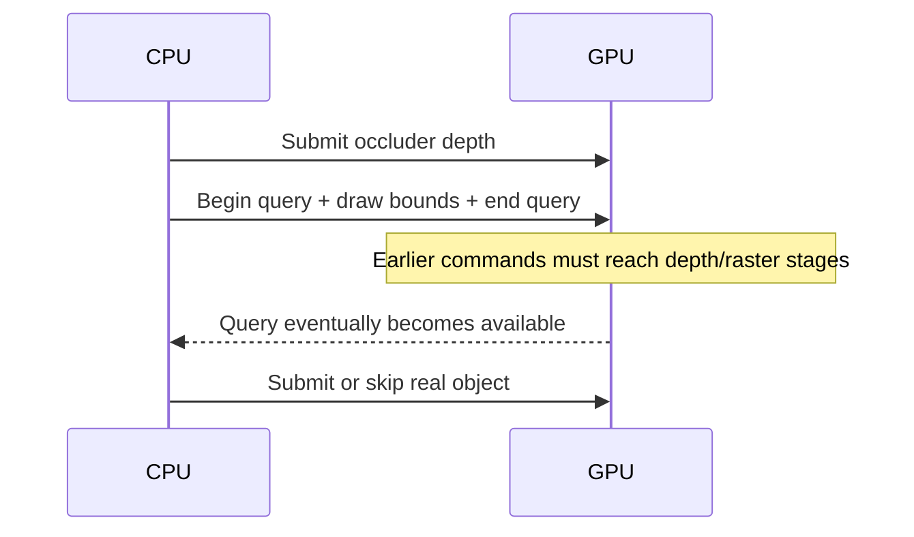
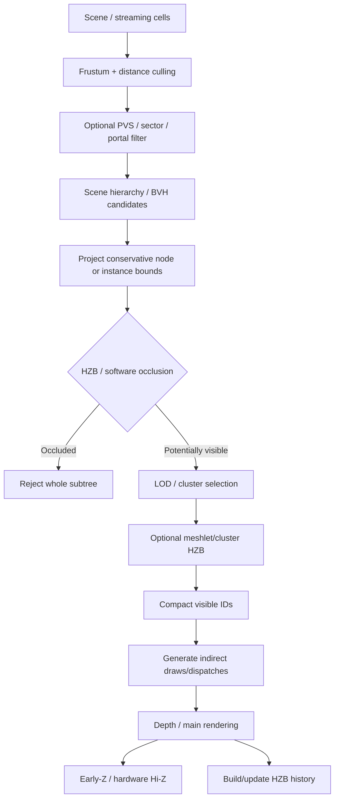

# State of the Art in Real-Time Occlusion Culling and Visibility Determination

## Executive summary

For a general-purpose real-time renderer in 2026 that already performs frustum culling, the strongest default architecture is **GPU-driven hierarchical-Z occlusion culling over a spatial/object hierarchy, followed by GPU-generated indirect draws or dispatches**. The important change relative to classic occlusion-query systems is not merely the use of a depth pyramid: it is keeping candidate generation, visibility testing, compaction, and draw generation on the GPU so that visibility does not need to make a CPU↔GPU round trip. NVIDIA's batched occlusion sample explicitly moved away from individual queries toward shader-based testing of many bounds at once, while modern Unreal work similarly combines HZB tests with GPU-resident per-instance feedback. citeturn25view4turn18view7

The second major design principle is **hierarchy**. Occlusion tests are rarely economical at one-query-per-object granularity when a scene has tens or hundreds of thousands of instances. Test coarse BVH/scene-graph nodes first; descend only when visible. This is the lineage from Greene–Kass–Miller's hierarchical Z-buffer, through Coherent Hierarchical Culling and CHC++, to newer GPU work such as Hierarchical Raster Occlusion Culling. CHC and CHC++ specifically exploit spatial and temporal coherence to reduce query traffic and stalls, while HROC moves hierarchy traversal and batched tests toward a highly GPU-oriented formulation. citeturn24search3turn23view1turn23view2turn24search4

**Per-object hardware occlusion queries remain useful, but they are no longer the first technique I would build for a new high-object-count engine.** The fundamental problem is latency: the result is generated by the GPU after earlier depth work has executed. Reading it synchronously stalls; consuming it later creates one or more frames of visibility latency. Unreal documents one-frame readback for its actor queries and explicitly notes popping under fast camera motion. D3D12 and Vulkan both expose efficient boolean forms for the common "did anything pass?" question, but the architectural latency remains unless the result stays on the GPU or is consumed later. citeturn18view6turn18view2turn19search0

**CPU software occlusion culling remains highly relevant**, particularly when the GPU is the bottleneck and spare CPU worker capacity exists. Intel's Masked Software Occlusion Culling was designed around SIMD CPUs, reported three times the speed of earlier software work while recovering 98% of the triangles culled by a full-resolution depth-buffer method, and supports interleaved traversal, rasterization, and visibility testing. Its public implementation also supports merging depth/coverage buffers and independent screen-space bins, making it suitable for task-parallel occluder fusion. citeturn25view0turn23view5turn23view6

**Portal/sector and PVS techniques are still excellent where the world topology genuinely fits them**, especially static interiors, streamed cells, urban blocks, or other strongly partitioned environments. They are poor universal replacements for online occlusion in dynamic worlds because their strength comes from precomputed visibility relationships. Current Unity documentation illustrates the distinction clearly: its baked system partitions scenes into cells and stores inter-cell visibility, while dynamic objects can be occluded but cannot themselves become occluders in that baked model. citeturn23view4turn18view0

**Hardware Hi-Z/early-Z is complementary rather than equivalent to object occlusion culling.** Early depth rejection can eliminate hidden fragments before expensive pixel shading, but the object has already entered the graphics pipeline; object-level HZB culling prevents unnecessary instances, vertices, meshlets, material work, and frequently command-processing work from being issued in the first place. NVIDIA's treatment explicitly distinguishes occlusion queries from early-Z rejection for this reason. citeturn24search2turn24search5

For correctness, the central engineering requirement is to distinguish two failure classes:

> **False-visible:** an actually hidden object is rendered. This wastes performance but is visually safe.

> **False-occluded:** an actually visible object is removed. This creates holes or popping and is normally unacceptable.

A production occlusion system should normally be deliberately biased toward false-visible results. Coarse HZB mips, expanded occludee bounds, depth epsilons, uncertain temporal history, and low-confidence tests should all resolve to **visible**. Conservative rasterization can help, but its direction matters: overestimated coverage is appropriate for testing an occludee envelope, while overestimating an occluder's coverage can incorrectly hide geometry. D3D12 documents that its conservative rasterizer is explicitly overestimated and may produce coverage false positives; Vulkan exposes both overestimated and underestimated modes. citeturn25view1turn25view2

The resulting recommendation matrix is:

| Constraint | Preferred design | Secondary technique | Usually avoid as primary |
|---|---|---|---|
| General high-end engine | GPU HZB + hierarchy + GPU compaction/indirect | Temporal two-pass HZB | Per-object query/readback |
| CPU-bound render thread | GPU-driven HZB and indirect submission | Baked PVS/portals | Heavy CPU rasterization unless spare workers exist |
| GPU-bound, CPU headroom | SIMD software occlusion / MOC | Low-resolution HZB | Expensive full-res extra GPU occlusion passes |
| Very high instance count | Hierarchical instance → cluster/meshlet HZB | Temporal coherence | One query per object |
| Memory constrained | Low-resolution/compressed software depth; selective hierarchy | Existing-depth HZB | Large baked global PVS |
| Static indoor | PVS/portal + fine online HZB | Queries for unusual dynamic content | Pure brute-force HZB over entire world |
| Dynamic/open world | GPU HZB + BVH/quadtree + temporal coherence | Terrain/horizon/domain-specific culling | Large static PVS |
| VR / latency sensitive | Conservative GPU-only current-frame/two-pass HZB | Stereo-union coarse tests | Multi-frame readback or aggressive stale history |
| Experimental neural scene representations | Neural visibility as an accelerator | HZB correctness fallback | Neural prediction as sole conservative visibility oracle |

This is a synthesis of current APIs, production-engine practice, recent GPU-oriented work, and the empirical behavior discussed below rather than a claim that one algorithm dominates every workload. The most important practical lesson from both older and newer measurements is that **occlusion culling must be cheaper than the work it avoids**: NVIDIA noted that query-based culling can slow scenes with little occlusion; Kitware's recent WebGPU results likewise show impressive gains in extremely geometry-heavy scenes but measurable HZB/communication overhead when workloads become small. citeturn23view4turn25view5

## Taxonomy and comparative analysis

Occlusion systems are easiest to reason about along two axes: **where visibility is represented** and **when it is computed**. Object-space approaches represent cells, portals, hierarchies, or visibility relations. Image-space approaches represent visible coverage/depth. Offline methods precompute relationships; online methods determine them from the current or recent view. Modern systems almost always combine several categories. citeturn22view1turn23view4

### Hierarchical Z-buffer and depth-pyramid culling

The classic hierarchical Z-buffer dates to Greene, Kass, and Miller's SIGGRAPH 1993 work. Its enduring idea is to combine an object hierarchy with a multiresolution depth representation so large regions can be rejected with a small number of image-space operations rather than testing every primitive individually. citeturn24search3turn24search9

The contemporary GPU version normally looks simpler than the original formulation:

1. obtain a conservative depth image;
2. repeatedly reduce 2×2 texel blocks into coarser depth levels;
3. project an object's conservative bounds into screen space;
4. choose a mip where those bounds cover only a few texels;
5. compare the object's nearest possible depth with the conservative depth of every texel overlapping its projected bounds.

Kitware's 2024 WebGPU implementation, for example, projects object bounds, selects a pyramid level where the projected rectangle is roughly 2×2 texels, and performs four depth fetches rather than checking the full screen rectangle. Unreal similarly describes its HZB culling as checking actor bounds against a mipmapped representation of scene depth. citeturn25view5turn18view6

The crucial conservative reduction is:

\[
HZB_{l+1}(x,y)=
\begin{cases}
\max(HZB_l(2x+i,2y+j)), & \text{normal Z, LESS}\\
\min(HZB_l(2x+i,2y+j)), & \text{reversed Z, GREATER}
\end{cases}
\]

for \(i,j\in\{0,1\}\).

Why? With conventional near=0/far=1 depth, the **maximum** stores the farthest occluding surface in the tile. Only an object whose nearest possible point is farther than that maximum can safely be declared hidden across the entire tile. With reversed Z, the ordering reverses, so the conservative aggregate is the **minimum**.

A complete W×H pyramid contains

\[
WH\left(1+\frac14+\frac1{16}+\dots\right)\approx\frac43 WH
\]

texels. Thus a separate R32F pyramid at 1920×1080 is approximately 11.1 MB including its base level; at 3840×2160 it is approximately 44.2 MB. If the full-resolution depth surface already exists and only the additional mip levels consume new storage, the incremental mip storage is approximately one third of the base image.

### Software rasterization and occluder fusion

Software occlusion rasterizers construct coverage/depth on the CPU, normally at reduced resolution and with highly specialized SIMD code. Unlike testing candidates against one explicit "occluder object," rasterization naturally **fuses many walls, terrain patches, buildings, and other occluders into a common coverage representation**. A candidate can therefore be rejected by the union of several occluders even if no single object covers it completely.

Intel's Masked Software Occlusion Culling decouples depth and coverage rather than storing an ordinary full depth value for every pixel. Its public implementation describes direct hierarchical updates, SIMD operation, independent screen bins, interleaving of rendering and testing, and merge operations for separately generated buffers. Front-to-back processing improves both depth quality and rasterization cost because occluders themselves can be rejected early. citeturn23view5turn23view6

MOC is especially interesting for a scene graph:

```text
visit node front-to-back
    if node outside frustum:
        return

    if node bounds occluded in CPU coverage/depth buffer:
        return

    if leaf:
        if good occluder:
            rasterize simplified occluder
        emit visible object
    else:
        visit children front-to-back
```

The visibility result directly controls whether traversal continues, avoiding the need to enumerate all descendants before deciding they are hidden. Intel explicitly describes this interleaving as useful for early exits in BVH traversal. citeturn23view5

### Portals, sectors, and PVS

A portal renderer divides the world into cells—typically rooms or sectors—connected by apertures such as doors, windows, tunnels, or explicit designer-defined portals. Starting from the camera's cell, the renderer recursively clips the view against visible portals and traverses only reachable cells. The method is very efficient when the environment naturally consists of well-separated spaces. NVIDIA's visibility discussion characterizes portals as a special case of occlusion culling and notes their strong association with mostly static indoor environments. citeturn23view4

A **Potentially Visible Set** moves more of the work offline. For each view cell or region, preprocessing produces a conservative set of geometry or cells that might be visible. Runtime then becomes approximately a cell lookup plus iteration through the compressed PVS. This idea goes back to Teller and Séquin's early visibility preprocessing work and remains foundational in static-world engines. Modern NeuralPVS work likewise describes traditional PVS systems as subdividing viewpoint space into static viewcells and storing a PVS for each cell. citeturn2search2turn22view1

The weakness is scaling and dynamism. Worst-case cell-to-cell visibility is quadratic in the number of cells before compression, and a changing world invalidates precomputed relationships. Modern Unity still provides such a baked system: it divides scenes into cells, generates inter-cell geometry/visibility information, merges cells to reduce stored data, and performs runtime queries over the baked representation. Its documentation recommends the technique particularly for rooms and corridors and states that dynamic objects cannot themselves act as occluders in the built-in baked system. citeturn18view0

### Hardware occlusion queries

A hardware occlusion query rasterizes proxy geometry against the current depth/stencil state and reports whether samples passed. D3D12 exposes ordinary sample-count and binary occlusion queries; the binary form is intended specifically for applications that care only whether an object is fully hidden and may permit more efficient depth/stencil handling. Queries live in query heaps, are bracketed by `BeginQuery`/`EndQuery`, and are materialized into memory using `ResolveQueryData`. citeturn18view2

Vulkan uses `VK_QUERY_TYPE_OCCLUSION` query pools with `vkCmdBeginQuery` and `vkCmdEndQuery`. Unless `VK_QUERY_CONTROL_PRECISE_BIT` is used on hardware supporting precise queries, a non-zero result only promises that something passed—not a precise sample count—which is normally exactly what culling needs. Results can be copied to a GPU buffer or requested in host memory. citeturn19search0turn19search8

Metal provides a render-pass visibility-result buffer and counting visibility mode that records depth/stencil visibility information, while Apple's modern GPU-driven rendering examples emphasize indirect command buffers for moving culling and command generation onto the GPU timeline. citeturn18view4turn25view3turn17search7

The naïve pattern—

```text
issue query
wait for result
decide whether to draw object
```

—is structurally bad because the CPU forces the GPU to drain work before visibility is known. CHC and CHC++ were designed specifically to make hardware queries practical by interleaving rendering and queries, using a spatial hierarchy, reusing temporal visibility, predicting visibility, and batching query work. CHC++ reports substantial reductions in both query count and state changes compared with preceding approaches. citeturn23view1turn23view2

### Hardware Hi-Z and early-Z

Hardware depth rejection should be treated as **hidden-surface removal inside rasterization**, not scene-level visibility determination. Z-cull/early-Z can reject an incoming fragment against depth before expensive fragment shading; this can dramatically reduce pixel work when near geometry has already populated depth. citeturn24search5

But by this stage the draw was issued and front-end processing occurred. Depending on architecture and pipeline, instance fetching, vertex or mesh shading, primitive setup, and at least part of rasterization can have happened. Consequently:

\[
\text{Object HZB} \rightarrow \text{avoid submitting hidden geometry}
\]

whereas

\[
\text{Early-Z} \rightarrow \text{submit geometry but avoid much hidden fragment work}.
\]

The techniques should therefore be stacked, not viewed as alternatives. NVIDIA's classic discussion explicitly presents occlusion query and early-Z as two distinct occlusion mechanisms. citeturn24search2

### Conservative rasterization

Conservative rasterization is an **enabler**, not a complete visibility algorithm. It changes the rasterization coverage rule so that coverage is safely enlarged or reduced.

D3D12's mode is overestimated: a pixel is rasterized whenever any part of a primitive overlaps it. Microsoft explicitly allows additional false-positive coverage from implementation-dependent snapping or growth. Vulkan's extension exposes both overestimated and underestimated conservative rasterization; underestimation produces a fragment only when the rectangular pixel is completely covered. citeturn25view1turn25view2

That distinction has an important occlusion-culling consequence:

| Use | Safe bias |
|---|---|
| Rasterizing **occludee bounds for visibility testing** | Overestimate the occludee footprint |
| Rasterizing **occluders into a visibility buffer** | Underestimate occluder coverage, or otherwise preserve conservative coverage/depth |
| Testing uncertain boundary pixels | Return visible |
| Building occlusion proxies | Proxy must not claim opaque coverage where the real occluder has none |

Using overestimated conservative rasterization to create an occluder mask without compensation can enlarge a wall by fractions of a pixel and produce a **false-occluded** object. This follows directly from the coverage semantics specified by D3D12 and Vulkan. citeturn25view1turn25view2

### Screen-space, temporal, learned, and hybrid approaches

"Screen-space occlusion culling" covers more than HZB. Hierarchical Occlusion Maps, for example, separate cumulative screen coverage from occluder depth and represent coverage at multiple resolutions. The common theme is converting a 3D visibility relationship into a cheap overlap/depth question in image space. citeturn24search20

Temporal systems reuse previous visibility or depth. There are two distinct variants:

**History reuse** tests objects using a previous-frame HZB or previous visibility labels and repairs newly visible regions later. This avoids an expensive geometric reprojection.

**Depth reprojection** reconstructs previous-frame depths into world/view space and projects them into the new camera. It can produce an excellent approximate occlusion buffer but creates holes near disocclusions, image borders, and rapid motion. A production account from *Life is Feudal* explicitly identifies reprojection holes and fast-camera gaps as its primary weakness. citeturn25view6

The most robust temporal architecture is therefore not "trust yesterday's visibility." It is:


This converts temporal history from a correctness oracle into a performance predictor. Kitware's recent two-pass HZB implementation similarly constructs current depth from previously visible objects and performs HZB tests rather than synchronously querying every candidate. citeturn25view5

Machine learning is now entering visibility determination but should still be considered specialized. **NeuralPVS**, published in 2025, predicts from-region PVS from a froxelized scene using sparse convolutions and 3D interleaving. The authors report roughly 10 ms inference, approximately 100 Hz, with less than 1% missing geometry; runtime is primarily determined by froxel-grid configuration rather than scene triangle count. Unlike conservative rasterization/HZB, however, the system deliberately accepts a non-zero false-negative rate, so it is not a drop-in conservative visibility oracle for artifact-intolerant conventional rendering. citeturn22view0turn22view1turn22view2

An even newer specialized example is **NVGS**, which learns view-dependent per-Gaussian visibility for 3D Gaussian Splatting. Its lightweight MLP is queried before expensive Gaussian instantiation/raster preparation; the paper reports real-time composed scenes exceeding 100 million Gaussians and substantial VRAM reductions. This is important research evidence that learned visibility can pay when the primitive representation has very high preprocessing/bandwidth cost, but it is not directly transferable to ordinary opaque triangle meshes. citeturn22view3turn22view4

The overall comparison is:

| Technique | Granularity | Main processor | Typical runtime cost | Memory | Result latency | Dynamic scenes | Parallelism | Conservative potential |
|---|---|---|---|---|---|---|---|---|
| PVS | cell/region | CPU | ~O(visible-cell set) | potentially high | none | weak for changing topology | excellent lookup/iteration | yes if conservatively baked citeturn22view1turn18view0 |
| Portal/sector | cell | CPU | O(visited portals/cells) + clipping | low–moderate | none | moderate | traversal dependencies | yes citeturn23view4 |
| Hardware query | object/bounds | GPU + often CPU | O(Q + proxy rasterization) | O(Q) | commonly ≥1 frame if nonblocking | good geometrically | query issue parallel, decision latency problematic | yes with safe bounds/history citeturn18view2turn18view6 |
| HZB compute | object/node/meshlet | GPU | O(P) pyramid + ~O(N) bound tests | O(P) | same-frame possible | excellent | excellent | excellent if implemented correctly citeturn25view5turn18view6 |
| Software MOC | node/object | CPU SIMD | O(T_occluder + N tests) | low-res/compact | immediate CPU | excellent | SIMD + tiles/tasks | designed for conservative use citeturn25view0turn23view5 |
| Early-Z/Hi-Z hardware | fragment/tile | fixed function | implicit in rasterization | hardware-private | immediate | excellent | hardware-wide | exact depth-test semantics citeturn24search5 |
| Conservative raster | pixel coverage | rasterizer | extra conservative coverage | normal render targets | immediate | excellent | hardware | depends on over/underestimate direction citeturn25view1turn25view2 |
| Reprojected coverage/depth | object against historical depth | GPU/CPU | reprojection + testing | image-sized | historical | moderate–good | excellent | difficult around motion/disocclusion citeturn25view6 |
| Hierarchical ROC | BVH groups → objects | GPU | batched coarse raster + fine tests | BVH + GPU buffers | GPU-local | good | very high | intended exact/conservative depending proxy setup citeturn24search4 |
| Learned PVS | region/froxel | GPU ML | roughly fixed network inference | model + sparse grid | immediate inference | potentially strong | very high | currently approximate citeturn22view0turn22view2 |

## Algorithmic mechanics and cost model

### Hierarchical Z in detail

Assume your frustum culler gives \(N\) candidate objects.

A straightforward full-resolution visibility test would inspect potentially \(O(A_i)\) pixels for candidate \(i\), where \(A_i\) is projected area. An HZB replaces that with approximately constant work—normally a small number of texture reads—after an \(O(P)\) pyramid construction over \(P=W\times H\) pixels. Kitware's implementation concretely reduces projected rectangles to four depth fetches at a suitable mip. citeturn25view5

Total approximate cost becomes:

\[
T_{\mathrm{HZB}}
=
T_{\mathrm{depth}}
+
c_p P
+
c_b N
+
T_{\mathrm{compact}}
\]

where \(c_p\) is a very small reduction cost per pyramid texel and \(c_b\) contains projection, mip selection, and a few samples.

The depth pyramid itself contains approximately \(4P/3\) elements, but GPU construction work is slightly less than this if mip 0 already exists:

\[
P/4 + P/16 + \cdots=P/3.
\]

The apparent \(O(N)\) testing cost can become \(O(H_v)\) with a hierarchy, where \(H_v\) is the number of **visited** hierarchy nodes. A deeply occluded subtree becomes one failed node test instead of thousands of object tests.

The conservative test for normal depth can be expressed as:

```cpp
bool isOccludedNormalZ(ScreenRect rect, float objectNearestDepth, Hzb hzb)
{
    if (!rect.valid || rect.crossesNearPlane)
        return false; // uncertain -> visible

    uint mip = chooseMipSoRectTouchesAtMost2x2Texels(rect, hzb);

    float farthestOccluder = -INF;

    for (Texel t : allTexelsOverlapping(rect, mip))
        farthestOccluder = max(farthestOccluder, hzb.load(mip, t));

    return objectNearestDepth > farthestOccluder + depthEpsilon;
}
```

For reversed Z:

```cpp
bool isOccludedReversedZ(ScreenRect rect, float objectNearestDepth, Hzb hzb)
{
    if (!rect.valid || rect.crossesNearPlane)
        return false;

    uint mip = chooseMipSoRectTouchesAtMost2x2Texels(rect, hzb);

    float farthestOccluder = +INF;

    for (Texel t : allTexelsOverlapping(rect, mip))
        farthestOccluder = min(farthestOccluder, hzb.load(mip, t));

    return objectNearestDepth < farthestOccluder - depthEpsilon;
}
```

The projected bound itself must be conservative. Merely projecting eight AABB corners is not sufficient when an edge intersects the near plane or produces \(w\le0\). A production implementation should either clip the bound in homogeneous space or conservatively classify such candidates visible.

A useful hierarchy kernel is:

```cpp
void CullNode(NodeId id)
{
    Node n = nodes[id];

    if (!FrustumIntersects(n.bounds))
        return;

    ProjectedBounds p = ProjectConservative(n.bounds);

    if (HzbOccluded(p))
        return;                              // entire subtree dies

    if (n.isLeaf) {
        uint lod = SelectLOD(n, p);
        visible.append({id, lod});
        return;
    }

    for (NodeId child : n.children)
        workQueue.append(child);
}
```

On a GPU, recursion becomes a queue, wave-based traversal, breadth-first hierarchy pass, or fixed hierarchy-level dispatch. HROC represents one research direction toward reducing costly per-node draw/dispatch behavior by rasterizing coarse groups and resolving fine visibility within those groups. citeturn24search4

### Software occlusion and fusion

For a low-resolution CPU rasterizer with \(T_o\) occluder triangles and \(P_s\) software pixels, a useful cost model is:

\[
T_{\mathrm{SOC}}
\approx
c_tT_o +
c_rR_o +
c_qQ
\]

where \(R_o\) is rasterized occluder coverage and \(Q\) is the number of bounds tested. Unlike the GPU HZB path, it need not pay a GPU synchronization or copy cost before CPU scene traversal can use the result.

The most important optimizations are structural:

**Occluder selection.** Large nearby opaque surfaces are valuable; tiny, perforated, alpha-tested, or distant triangles often cost more to rasterize than they contribute.

**Proxy geometry.** Build simplified conservative occluders for buildings, terrain, cliffs, etc. A proxy must not close windows or holes that can expose relevant geometry.

**Front-to-back order.** Near occluders populate coverage quickly and make later occluder rasterization itself rejectable. MOC's documentation explicitly recommends this ordering. citeturn23view5

**Interleave query and rasterization.** Test a node against existing coverage before spending time rasterizing its own potential occluder geometry. MOC is explicitly designed for this pattern. citeturn23view5

**Task decomposition.** Either partition the screen into non-overlapping bins or give workers private buffers and merge them. MOC exposes both independent bin processing and `MergeBuffer` functionality. citeturn23view6

Conceptually:

```cpp
parallel_for(each coarse screen bin)
{
    for (Occluder o : occludersOverlapping(bin))
        RasterizeConservative(o, localCoverageDepth[bin]);
}

Barrier();

parallel_for(each candidate)
{
    Bounds b = Project(candidate.bounds);
    visible[candidate] = !Occluded(b, coverageDepth);
}
```

An alternative with private buffers:

```cpp
parallel_for(worker)
{
    local[worker].clear();

    for (Occluder o : workerOccluders[worker])
        local[worker].rasterize(o);
}

parallel_reduce(localBuffers, MergeConservativeCoverage);
```

The second form reduces write contention but makes the merge an explicit bandwidth phase.

### Queries and query latency

Hardware queries are best modeled not just by query execution time but by a pipeline dependency:



Waiting between the middle two steps serializes the pipelines. CHC's contribution was to keep doing useful traversal/rendering while queries were in flight and to use coherence to reduce how many tests were needed; CHC++ added adaptive prediction and batching to reduce queries and state changes further. citeturn23view1turn23view2

A nonblocking engine pattern is therefore:

```cpp
for (Candidate c : candidatesFrontToBack) {
    QueryResult previous = queryRing[previousFrame].tryRead(c);

    // Never stall for unavailable information.
    bool assumeVisible = !previous.available || previous.samplesPassed;

    if (assumeVisible)
        submit(c);

    IssueBinaryQueryForConservativeBounds(c, queryRing[currentFrame]);
}
```

This is safe only if **stale "occluded" results are handled conservatively**. Camera teleports, rapid rotations, moving occluders, newly animated geometry, and bounds changes should invalidate history or force objects visible until retested. Unreal's one-frame query behavior and documented fast-camera popping illustrate the risk. citeturn18view6

### PVS and portal complexity

For \(C\) view cells, naïvely storing a bit for every cell pair is \(O(C^2)\) bits. Real engines compress sparse sets, merge cells, store object IDs rather than all cell pairs, or restrict visibility to a streaming hierarchy. Unity, for example, merges cells during baking to reduce generated data. citeturn18view0

Portal traversal instead depends principally on the visible portion of the graph:

\[
O(V_{\mathrm{visited}} + E_{\mathrm{portal\ visited}})
\]

plus portal-frustum clipping. This makes the technique extraordinarily attractive for a corridor-heavy level and relatively unhelpful for a flat open field where one sector sees nearly everything. NVIDIA made the same high-level observation about the indoor/static character of portal methods. citeturn23view4

### Parallelization characteristics

Occlusion methods differ substantially in where synchronization appears.

| Method | Parallel region | Serial/dependency pressure |
|---|---|---|
| GPU HZB | candidates, texel reductions, hierarchy nodes | dependency between pyramid levels; hierarchy levels |
| MOC | SIMD triangles, screen bins, candidates | shared coverage updates or merge |
| Hardware query | query rasterization | visibility result follows earlier depth/raster work |
| Portal | separate portal branches possible | clipped-frustum traversal creates dependencies |
| PVS | object iteration | effectively none after lookup |
| HROC | GPU coarse groups/fine tests | hierarchy/buffer compaction stages |
| Neural PVS | CNN sparse operators | network-layer dependencies, high intra-layer parallelism |

HZB mip construction is often a chain of short dependent compute reductions. This explains why a tiny scene can make the culling pass look disproportionately expensive: Kitware explicitly observed that at sub-2-ms frame times, repeated HZB mip generation and synchronization became significant. citeturn25view5

## Integration architecture and implementation

### Integration with existing frustum culling

Since frustum culling is already implemented, keep it as the first inexpensive geometric filter unless moving the entire hierarchy onto the GPU.

A robust generic pipeline is:



The reason frustum testing precedes screen-space projection is not only arithmetic cost: off-frustum objects are often awkward to project conservatively, particularly near/behind the camera. Unity's current implementation similarly describes frustum and occlusion as cumulative rather than mutually exclusive filters. citeturn18view0

### Interaction with LOD

LOD and occlusion should not be designed as isolated systems.

For ordinary object LODs, a good sequence is:

\[
\text{coarse frustum/distance}
\rightarrow
\text{occlusion}
\rightarrow
\text{final expensive LOD/streaming decision}.
\]

This avoids loading or constructing a high-detail representation for something that is completely hidden.

For hierarchical/clustered geometry, however, LOD and visibility can use the **same hierarchy**:

```text
root bound
  visible?
    no  -> stop
    yes -> projected error acceptable?
             yes -> render this node/cluster representation
             no  -> descend
```

This is particularly powerful for meshlet/cluster engines because the traversal decision can simultaneously answer:

- is this subtree visible?
- does it meet screen-space error?
- should finer geometry be streamed?
- should children be dispatched?

Recent GPU-driven rendering systems increasingly favor this kind of integrated hierarchy rather than a CPU-generated list of independently culled objects. Microsoft's Direct3D guidance explicitly notes that indirect drawing allows scene traversal and culling work to move from CPU to GPU; Apple's Metal sample library similarly includes GPU-encoded indirect-command culling. citeturn17search6turn17search7

### Direct3D integration

For classic D3D12 hardware queries:

```cpp
// Conceptual, not complete D3D12 code.
cmd->BeginQuery(queryHeap, D3D12_QUERY_TYPE_BINARY_OCCLUSION, q);

DrawConservativeBoundingGeometry(
    /* color writes = off,
       depth writes = off,
       depth comparison matches main depth */
);

cmd->EndQuery(queryHeap, D3D12_QUERY_TYPE_BINARY_OCCLUSION, q);

cmd->ResolveQueryData(
    queryHeap,
    D3D12_QUERY_TYPE_BINARY_OCCLUSION,
    q, 1,
    queryResultBuffer,
    resultOffset);
```

D3D12's binary query returns the logical distinction required for visibility—zero if no samples passed and non-zero if at least one did—without requesting a precise count. Query results are explicitly decoupled from predication in D3D12. citeturn18view2

For a modern HZB path:

```text
Depth prepass / selected occluders
    ↓
transition depth to shader-readable state
    ↓
compute mip reductions
    ↓
compute cull instances/nodes
    ↓
append or prefix-sum visible IDs
    ↓
write ExecuteIndirect arguments
    ↓
transition/barrier buffers as required
    ↓
ExecuteIndirect
```

Microsoft's `ExecuteIndirect` sample demonstrates the general GPU-culling pattern: a compute shader determines visibility and produces an argument buffer from which only surviving work enters the graphics pipeline. citeturn17search3turn17search1

A practical HZB resource layout is one shader-readable/UAV-capable single-channel texture with a complete mip chain. If the native hardware depth image cannot safely serve both roles, write or copy a resolved depth representation to a dedicated pyramid texture. For MSAA depth, reduction must conservatively account for all samples rather than using an averaging resolve.

### Vulkan integration

Classic Vulkan queries follow:

```cpp
vkCmdResetQueryPool(cmd, pool, first, count);

vkCmdBeginQuery(cmd, pool, q, 0); // no PRECISE bit needed for boolean use
DrawBoundingProxy(cmd);
vkCmdEndQuery(cmd, pool, q);

// Later:
vkCmdCopyQueryPoolResults(cmd, pool, q, 1,
                          gpuResultBuffer, offset, stride, flags);
```

The Vulkan specification states that a non-precise occlusion query may return any non-zero value when at least one sample passed. This is desirable for binary visibility because an exact sample count only imposes requirements the culler does not need. citeturn19search0turn19search8

For GPU-driven HZB, the preferred pattern is to place candidate bounds and scene metadata in storage buffers, dispatch a compute culler, compact surviving draw IDs, and feed a GPU-generated indirect buffer into indirect drawing. Avoid `vkGetQueryPoolResults` on the critical path when the point of the system is to prevent CPU/GPU synchronization; the specification provides device-buffer result copying precisely so results need not immediately return to host memory. citeturn19search0

Vulkan's `VK_EXT_conservative_rasterization` additionally permits explicit overestimate or underestimate coverage where supported, which is useful when rasterizing occlusion proxies or conservative test envelopes. citeturn25view2

### Metal integration

Metal's conventional mechanism is the render pass's `visibilityResultBuffer`, with a visibility-result mode determining what the GPU writes for a draw's depth/stencil result. Apple also exposes indirect command buffers and provides a GPU-encoding sample specifically aimed at performing culling on the GPU and rendering only selected objects. citeturn18view4turn25view3turn17search7

For a portable engine abstraction, I would therefore model Metal similarly to D3D/Vulkan at the engine level:

```cpp
struct VisibilityBackend {
    BuildDepthPyramid();
    CullBounds(candidateBuffer, depthPyramid, visibleBuffer);
    BuildIndirectCommands(visibleBuffer);
    ExecuteIndirect();
};
```

and keep native visibility-result queries as an alternative path for workloads where explicit query semantics are advantageous.

### Hi-Z generation

A straightforward compute implementation for reversed Z is:

```hlsl
// Conceptual HLSL-like code.
// Reversed-Z: min() preserves the farthest occluder in a 2x2 tile.

[numthreads(8, 8, 1)]
void DownsampleHZB(uint2 dst)
{
    uint2 src = dst * 2;

    float z0 = Src.Load(int3(src + uint2(0,0), 0));
    float z1 = Src.Load(int3(src + uint2(1,0), 0));
    float z2 = Src.Load(int3(src + uint2(0,1), 0));
    float z3 = Src.Load(int3(src + uint2(1,1), 0));

    Dst[dst] = min(min(z0, z1), min(z2, z3));
}
```

For standard Z, replace `min` with `max`.

A simple loop is:

```cpp
for (uint mip = 1; mip < mipCount; ++mip) {
    bindSRV(hzb, mip - 1);
    bindUAV(hzb, mip);
    dispatch(ceil(width[mip] / 8.0),
             ceil(height[mip] / 8.0),
             1);

    barrierBetweenMipProducerAndConsumer();
}
```

This is easy to implement and profile. Once it proves significant, a more sophisticated downsampler can generate several mip levels per dispatch to reduce repeated launch/barrier cost. Kitware's experience is a useful warning that sequential mip passes and synchronization can become visible overhead in already-fast frames. citeturn25view5

### Scene-graph and spatial-hierarchy integration

The hierarchy should be designed around **occlusion economics**, not merely spatial correctness.

A good node bounds:

- several expensive descendants;
- projects compactly;
- has a cheap conservative screen bound;
- is spatially coherent enough that one hidden node often eliminates substantial work.

A bad hierarchy places one huge loose AABB around unrelated geometry; such a node remains visible because one corner is exposed, forcing traversal of every child.

CHC and CHC++ are important here because their main insight was that scene hierarchy, front-to-back order, temporal coherence, and asynchronous queries need to be designed together rather than bolted together. citeturn23view1turn23view2

For a modern GPU implementation, a two-tier hierarchy is often enough:

```text
Instance/sector BVH
      ↓
instance visible
      ↓
LOD / meshlet hierarchy
      ↓
cluster visible
      ↓
indirect rasterization
```

Testing every triangle or tiny meshlet against the HZB is generally wasteful; use coarse tests to eliminate whole regions and only use fine tests after surviving the coarse level.

## Workload trade-offs and robustness

### Static interiors

This is the ideal domain for portals/PVS because visibility entropy is low. A camera in a room normally has a small set of reachable portals, and large sections of the level can be eliminated without touching depth.

Recommended stack:

```text
camera cell
→ PVS/portal traversal
→ frustum
→ coarse HZB/query for dynamic objects
→ normal rendering / early-Z
```

The production precedent is strong. S.T.A.L.K.E.R. used sector/portal culling followed by CPU hierarchical occlusion and then GPU occlusion queries for its lighting workload. In typical closed-space frames, its hierarchical system reduced candidate lights by 30–50%, and the combined culling optimizations produced at least a twofold performance improvement in the described renderer. citeturn23view3

Static PVS is less appealing if doors destroy topology, destructible walls open new sightlines, or user-generated geometry changes occlusion relationships. In such environments, either mark potentially changing areas conservatively visible or let online HZB/software visibility dominate.

### Highly dynamic scenes

Dynamic scenes favor depth-derived online techniques because the depth buffer automatically incorporates current transforms.

Best candidates are:

- GPU HZB;
- SIMD software occlusion if CPU resources allow;
- current-frame depth/coverage;
- hierarchy traversal whose bounds are updated incrementally.

The main danger is **temporal reasoning**, not the underlying HZB. A previous frame containing a wall that moved away must not be allowed to suppress an object now exposed. Likewise, a stale transformed AABB for a skinned/destructible object can cause genuine false occlusion.

A robust rule is:

```cpp
if (cameraDiscontinuity ||
    occluderMovedSignificantly ||
    objectBoundsChanged ||
    visibilityHistoryTooOld)
{
    visibility = Visible; // bootstrap correctness
}
```

History can then recover once a fresh current-frame test succeeds.

### Large open worlds

Open worlds are difficult because **occlusion ratio varies drastically with viewpoint**. At street level, buildings and terrain may hide most content; from an aircraft, little may be occluded. NVIDIA's classic query guidance explicitly recommends disabling occlusion when navigation modes contain little or no occlusion because query overhead can make rendering slower. citeturn23view4

A strong open-world architecture is therefore adaptive:

```text
streaming/world cells
→ distance/frustum
→ quadtree/BVH
→ terrain/domain-specific visibility
→ instance HZB
→ cluster HZB
→ indirect draw
```

Maintain a rolling metric:

\[
B =
\frac{\text{estimated avoided rendering cost}}
     {\text{occlusion-pass cost}}.
\]

If \(B\le1\) for sustained frames, reduce HZB granularity, skip fine-level tests, or disable expensive occlusion passes for that camera mode.

A common mistake is to use object count as the metric. Culling 10,000 one-triangle grass markers may save less than culling one building containing a million triangles and expensive materials. Candidate value should be approximately:

\[
V_i=P(\text{occluded}_i)\cdot C(\text{render}_i)-C(\text{test}_i).
\]

Test high-value candidates first.

### VR and stereo

VR turns visibility latency into a perceptual concern. Fast head rotation exposes regions much more abruptly than ordinary controller/camera motion, so a one-frame occlusion mistake is substantially harder to hide.

Unreal's documented **Round Robin Occlusion** alternates queries between eyes to reduce query work but adds another frame of occlusion-data latency and can result in incorrect peripheral rendering. That trade-off is useful evidence that stereo visibility optimization cannot be evaluated purely by GPU milliseconds. citeturn18view6

For latency-sensitive VR I would prefer:

1. GPU-only visibility decisions with no CPU readback.
2. Current-frame or two-pass HZB for important geometry.
3. Conservative expansion of bounds for predicted head motion.
4. Either independent HZBs per eye or a deliberately conservative stereo-union coarse test.
5. Immediate visibility bootstrap after a head-pose discontinuity.
6. Temporal occlusion only as a prediction mechanism, never as the only correctness mechanism.

A center-eye HZB should not blindly be treated as valid for both eyes near geometry because binocular parallax changes occlusion relationships.

### Robustness and precision

The following issues account for most production artifacts:

| Failure | Consequence | Mitigation |
|---|---|---|
| HZB mip too coarse | false-visible | acceptable; descend/use finer mip for expensive object |
| Incorrect reduction direction | false-occluded | max for normal Z, min for reversed Z |
| Occludee screen rect underestimated | false-occluded | expand bounds / conservative rasterization |
| Occluder coverage overestimated | false-occluded | underestimate occluder or treat boundary uncertain |
| Bounding box crosses near plane | projection instability | clip conservatively or return visible |
| Stale moving occluder history | false-occluded | invalidate history |
| Camera teleport | massive stale visibility | clear history / make all uncertain objects visible |
| Depth quantization | edge flicker | depth epsilon and conservative comparison |
| TAA projection jitter | visibility instability | use stable culling projection or expand by jitter envelope |
| Alpha-tested fence used as solid proxy | hidden objects disappear through holes | rasterize alpha-aware depth or do not use as occluder |
| Transparent surface as occluder | incorrect visibility | exclude unless renderer's visibility semantics truly make it opaque |
| Loose BVH node | false-visible | tighter hierarchy; subdivide |
| Too-tight animated bounds | false-occluded | conservative animation/skinning bounds |
| Temporal reprojected holes | poor culling | mark holes as unknown/visible |
| Temporal foreground smeared into holes | false-occluded | never repair holes by inventing near occluder depth |
| Stereo reuse without parallax margin | eye-specific popping | separate tests or conservative stereo bounds |

The distinction between coverage expansion for occludees and coverage contraction for occluders is particularly important. D3D12 explicitly permits coverage false positives in overestimated conservative rasterization; Vulkan explicitly defines both over- and underestimated semantics. citeturn25view1turn25view2

Depth equality should normally resolve to visible or use a small safety margin. Intel's MOC rectangle test, for example, uses a reversed-depth greater-or-equal comparison so equal-depth samples count as visible rather than aggressively hidden. citeturn23view6

Temporal reprojection deserves special caution. Reprojection naturally leaves holes after fast camera motion; enlarging foreground depths to "fill" those holes may improve measured culling but can convert a harmless false-visible region into a false-occluded artifact. The *Life is Feudal* implementation discussion specifically identifies gaps and holes as the difficult part of reprojected coverage buffers. citeturn25view6

### Occlusion-query safety

A classic query should rasterize a bounding proxy with:

```text
color writes:       disabled
depth writes:       disabled
depth test:         same ordering as main rendering
proxy:              completely encloses candidate
query type:         binary where available
```

Do not query detailed object geometry merely to decide whether to render that same expensive geometry unless the query geometry itself is substantially cheaper.

For a hierarchy:

```cpp
if (Query(node.bounds) == OCCLUDED)
    skip node.subtree;
else if (node.isLeaf())
    draw(node.object);
else
    queryChildren(node);
```

This is the essential object-space optimization behind CHC-style designs. citeturn23view1turn23view2

## Evidence and profiling methodology

Published occlusion numbers are unusually hard to compare because benefit depends on screen resolution, occlusion ratio, average object size, triangle count, shader cost, camera path, and whether visibility runs on the CPU or GPU. The table therefore reports each result **under its original conditions**, rather than pretending that the numbers form a common benchmark.

| Source | Conditions | Reported result | What it demonstrates |
|---|---|---|---|
| Masked Software Occlusion Culling, 2016 | SIMD CPU algorithm; comparison with earlier software and full-resolution depth method | ~3× faster than previous work; recovers ~98% of triangles culled by full-resolution depth | Low-resolution/compressed software depth can retain most useful culling power. citeturn25view0 |
| CHC++, 2008 | Hierarchical hardware-query system using temporal prediction and batching | Significantly fewer queries/state changes; authors report very large improvements over preceding methods | Query scheduling/coherence matters as much as raw query speed. citeturn23view2 |
| S.T.A.L.K.E.R., GPU Gems 2 | GeForce 6800 Ultra target, 1024×768, 30-fps target; ~50 lights/frame in closed spaces, depth complexity ~2.5 | coarse visibility reduced lights ~30–50%; combined culling optimizations ≥2× performance | Hybrid sector + CPU hierarchy + GPU query can be highly effective in heavily occluded interiors. citeturn23view3 |
| VTK WebGPU HZB, 2024 | Bistro, ~1,300 actors, 1280×720; geometry subdivided to 155M and 624M triangles | occlusion alone ~1.5× and 1.6×; frustum+occlusion ~5–6× vs WebGPU no-cull | Modern compute HZB pays when avoided geometry is enormous. citeturn25view5 |
| Same VTK test, smaller workload | ~10M triangles | CPU-frustum OpenGL path beat GPU frustum+occlusion path | HZB construction/communication can dominate when there is not enough work to save. citeturn25view5 |
| Unreal Engine 5.4 instance culling | HZB per-instance followed by full-depth per-pixel feedback for initial implementation | average ~20% reduction in drawn primitives in depth/base passes; intended to help vertex-limited scenes | Fine current-frame GPU feedback can reduce geometry after coarse HZB classification. citeturn18view7 |
| NeuralPVS, 2025 | RTX 4090 comparison; large test scenes; froxelized from-region visibility | ~10 ms / ~100 Hz; <1% missing geometry; trim-region baseline cited at ~18 ms/57 Hz | Learned approximate PVS is now real-time, but not strictly conservative. citeturn22view0turn22view2 |
| NVGS, 2026 | RTX 3090 Ti, 1080p, ~60M-Gaussian composed scenes in comparison table | neural-visibility variant roughly 3.1–4.5 GB VRAM vs 11.5–16.9 GB for baseline gsplat in the listed scenes; full system supports >100M Gaussians at real-time rates | Learned visibility can strongly reduce instantiation/bandwidth cost in neural primitive renderers. citeturn22view3turn22view4 |

The VTK results are particularly useful because the same implementation exhibits both outcomes: large speedups at 155–624 million triangles and overhead at around 10 million. That is a much better model for engineering expectations than assuming "HZB always improves FPS." citeturn25view5

### Profiling methodology

Benchmark visibility using **recorded deterministic camera traces**, not hand-controlled runs. At minimum, include four regimes:

| Trace | Purpose |
|---|---|
| Dense indoor / street canyon | high occlusion |
| Open landscape / aerial camera | low occlusion worst case |
| Rapid rotations / strafing | temporal-disocclusion stress |
| Teleports + dynamic occluders | correctness-history stress |

For every trace, capture:

\[
T_\text{net gain}
=
T_\text{baseline frame}
-
T_\text{occlusion frame}.
\]

Do not report only the culling-pass time.

Measure separately:

```text
CPU
  frustum time
  hierarchy traversal
  software rasterization, if any
  query-management time
  command-generation time
  render-thread submission time

GPU
  depth/occluder pass
  HZB generation
  hierarchy/instance culling
  candidate compaction
  indirect argument generation
  main depth pass
  base/G-buffer pass
  shadow passes

Counts
  candidates before frustum
  after frustum
  after coarse hierarchy
  HZB tests
  nodes rejected
  objects rejected
  clusters/meshlets rejected
  submitted draws/dispatches
  triangles/vertices/fragments avoided
```

Unreal's own visibility profiling exposes the same classes of quantities—frustum time, occlusion-cull time, processed primitives, occluded primitives, query count, and visible mesh elements—which is a good indication of what a production renderer needs to observe. citeturn18view6

Run these ablations:

| Configuration | Question answered |
|---|---|
| Occlusion fully off | true baseline |
| HZB generation on, tests off | cost of pyramid |
| HZB + tests, no candidate rejection | test/compaction overhead |
| Frustum only | marginal value beyond your existing system |
| Frustum + coarse HZB | value of first level |
| Frustum + coarse + fine HZB | value of fine meshlet/object tests |
| Temporal history disabled | value and risk of coherence |
| Current-frame rescue disabled | cost/benefit of disocclusion repair |
| Software occluder raster only | CPU-side construction cost |
| Low-res vs full-res HZB | bandwidth/accuracy curve |

For GPU profiling, avoid CPU stopwatch measurements around command submission. Use GPU timestamp queries around each pass and inspect pipeline counters using vendor tooling where available. Report median, 95th, and 99th-percentile frame times rather than only average FPS, because query stalls and history resets frequently manifest as tail-latency events.

### Correctness profiling

Build a **ground-truth visibility oracle** in an offline/debug mode.

A practical method is to render the complete frustum-surviving set with object IDs and compare it against the culled render. For each candidate \(i\), determine whether any ground-truth sample was actually visible.

Then compute:

\[
F_{\text{occ}}=
\frac{\#\text{visible objects wrongly culled}}
     {\#\text{truly visible objects}}
\]

and

\[
F_{\text{vis}}=
\frac{\#\text{hidden objects unnecessarily rendered}}
     {\#\text{truly hidden objects}}.
\]

The first metric is the dangerous one. Also weight false occlusion by visible pixel count:

\[
E_{\mathrm{pixels}}
=
\frac{\text{missing visible pixels}}
     {\text{total visible pixels}}.
\]

For conventional opaque geometry, the desired false-occluded rate should normally be **zero within the engine's numerical tolerance**. Approximate methods such as NeuralPVS explicitly operate under a different quality model and report false-negative/image-quality metrics instead. citeturn22view0turn22view2

For temporal methods, add an "occlusion age" debug visualization:

```text
green   = tested this frame, visible
red     = tested this frame, occluded
yellow  = visibility inherited 1 frame
orange  = inherited 2+ frames
purple  = invalid history / force-visible
```

This makes hidden dependence on stale information immediately obvious.

## Recommendations, roadmap, and key sources

### Recommended architecture by constraint

**CPU-bound renderer.** Move visibility and draw generation to the GPU rather than adding heavy CPU rasterization. A compute HZB pass followed by compacted indirect commands is the natural target. D3D12's indirect-drawing documentation explicitly positions indirect execution as a way to move scene traversal/culling away from the CPU, and Apple demonstrates equivalent GPU command encoding with Metal indirect command buffers. citeturn17search6turn17search7

If the CPU bottleneck is specifically draw submission but several worker cores are underutilized, MOC becomes plausible because early subtree elimination can also reduce command generation. Profile carefully: Unity's current documentation gives the general warning that CPU-side occlusion calculations can offset CPU time otherwise saved. citeturn25view0turn18view0

**GPU-bound renderer with CPU headroom.** Software MOC is unusually attractive because it moves visibility cost onto the underutilized processor while reducing GPU geometry/shading. Start with low-resolution simplified occluders rather than trying to reproduce the full GPU depth buffer. Intel's results show why that approximation can be effective. citeturn25view0

GPU HZB is still worth testing if the bottleneck is vertex/mesh or expensive material work rather than compute/bandwidth, particularly when a depth prepass already exists.

**Memory-limited renderer.** Avoid large all-world PVS tables unless the topology provides exceptional compression. Prefer a compact spatial hierarchy and a reduced-resolution HZB or masked software depth representation. A full same-resolution 32-bit HZB chain costs roughly 4/3 of a single-channel base depth image; quarter-width/quarter-height construction reduces that storage by approximately sixteen times at the expense of more false-visible objects.

**Latency-sensitive renderer.** Do not block on individual hardware query results. Use a GPU-local visibility buffer, same-frame HZB, or a two-pass temporal scheme where uncertain candidates are re-tested against current depth. Hardware query history should be a hint. Unreal's documented one-frame query readback and additional VR round-robin latency illustrate exactly why. citeturn18view6

**Static structured world.** Add portals/PVS before investing in extremely sophisticated fine-grained HZB. A cell-level lookup may remove 90% of the candidate world without any image-space work. Use online HZB for dynamic objects or subdivisions within surviving sectors. The continued use of baked cell visibility in Unity and classic production hybrids demonstrates that precomputation remains valuable where scene assumptions fit. citeturn18view0turn23view3

**Large open/dynamic world.** Build a quadtree/BVH or instance hierarchy, cull it on the GPU, and use HZB at one or two granularities. Make occlusion adaptive so flyover/aerial modes do not pay for low-yield testing. NVIDIA's observation that low-occlusion scenes can become slower with query overhead remains architecturally valid. citeturn23view4

**VR.** Prefer GPU-local same-frame visibility and conservative stereo rules. Avoid aggressive stale visibility and validate under maximum expected head angular velocity, not only normal locomotion. Round-robin eye queries are an optional throughput optimization only after correctness and latency are measured. citeturn18view6

### Prioritized implementation roadmap

Given that frustum culling already exists, I would implement in the following order.

**First: instrumentation and conservative screen-space bounds.** Before adding an occlusion algorithm, expose candidate counts, object cost estimates, projected bounds, and deterministic camera traces. Implement robust AABB/sphere projection including near-plane handling. Add an oracle/debug mode for false-occluded detection.

**Next: GPU HZB prototype.** Reuse your existing depth pass where practical. Build a normal/reversed-Z-safe mip chain and test frustum-surviving instance bounds in a compute shader. Initially return a visibility bitset without changing rendering so correctness is easy to compare. HZB's use of mipmapped scene depth for bound tests is a well-established engine pattern. citeturn18view6turn25view5

**Then: eliminate readback.** Compact visible IDs on the GPU and feed them directly into indirect draw/dispatch commands. This is the architectural step that turns a depth-pyramid experiment into a scalable GPU-driven visibility system. NVIDIA's batched sample and modern D3D/Metal indirect interfaces support this pattern. citeturn25view4turn17search3turn17search7

**Then: add hierarchical coarse culling.** Test scene/BVH nodes before objects. For very large object counts, add a second instance→cluster/meshlet hierarchy so a visible building does not imply every internal cluster is processed. The historical evolution from HZB through CHC/CHC++ and HROC strongly supports hierarchy as the route to scale. citeturn24search3turn23view1turn23view2turn24search4

**Then: integrate LOD and streaming.** Make hierarchy traversal produce both visibility and LOD decisions. Do not request high-detail geometry for hidden subtrees.

**Then: temporal acceleration.** Use previous visibility/HZB to seed a first pass, but implement a current-frame rescue path for uncertain/newly exposed candidates. Reset history on camera discontinuities and major scene changes. Temporal reprojection can be evaluated separately but should treat holes as visible. citeturn25view6turn25view5

**Then: workload-specific alternatives.** If profiling shows HZB itself is too expensive on a GPU-bound target with spare CPU cores, prototype MOC. If the title contains static maze-like interiors, add PVS/sector/portal visibility. If high aerial views show negligible occlusion benefit, adaptively disable fine occlusion. citeturn25view0turn18view0turn23view4

**Finally: experimental methods.** Learned PVS or learned visibility is worth investigating for gigantic streaming regions, neural rendering, or workloads where visibility preprocessing dominates, but at present I would place it above—not instead of—a conservative fallback for conventional opaque triangle rendering. NeuralPVS demonstrates compelling real-time performance but explicitly allows missing geometry, while NVGS shows particularly strong results in the much more specialized Gaussian-splatting domain. citeturn22view0turn22view3

The priority can be summarized as:

```text
Highest ROI / broadest applicability
        │
        ▼
robust conservative bounds + profiling
        │
        ▼
GPU HZB
        │
        ▼
GPU compaction + indirect rendering
        │
        ▼
hierarchical instance/node culling
        │
        ▼
LOD / meshlet hierarchy integration
        │
        ▼
two-pass temporal coherence
        │
        ├── CPU MOC if GPU-bound / CPU available
        ├── PVS + portals if static structured world
        └── adaptive disable if low-occlusion camera
        │
        ▼
learned / specialized visibility
```

### Key papers and research

The following are the most useful primary or near-primary references to study in implementation order.

| Work | Why it matters |
|---|---|
| **Teller & Séquin — visibility preprocessing / PVS, 1991** | Foundational region/cell-based precomputed visibility and the conceptual basis of PVS. citeturn2search2 |
| **Greene, Kass & Miller — “Hierarchical Z-Buffer Visibility,” SIGGRAPH 1993** | Foundational combination of object hierarchy and hierarchical image-space depth. citeturn24search3turn24search9 |
| **Zhang et al. — Hierarchical Occlusion Maps** | Separates coverage and depth and develops multiresolution screen-space occlusion representation. citeturn24search20 |
| **Bittner et al. — “Coherent Hierarchical Culling,” 2004** | Essential treatment of hierarchy, asynchronous hardware queries, and temporal/spatial coherence. citeturn23view1 |
| **Mattausch et al. — “CHC++: Coherent Hierarchical Culling Revisited,” 2008** | Adaptive prediction and batching; still highly relevant for understanding query scheduling. citeturn23view2 |
| **Hasselgren, Andersson & Akenine-Möller — “Masked Software Occlusion Culling,” 2016** | Probably the most practically useful modern CPU software-occlusion reference and public implementation. citeturn25view0turn23view5 |
| **Lee et al. — “Hierarchical Raster Occlusion Culling,” 2021** | Modern GPU-oriented hierarchical raster-occlusion design for large object sets. citeturn24search4 |
| **Karis, Stubbe & Wihlidal — Nanite deep dive, 2021** | Important production reference for GPU-driven geometry hierarchies, streaming, culling, and virtualized geometry architecture. |
| **Wang et al. — “NeuralPVS,” 2025** | Current learned from-region PVS research; useful for understanding where ML visibility is becoming practical and where approximation enters. citeturn22view0turn22view2 |
| **“NVGS: Neural Visibility for Occlusion Culling in 3D Gaussian Splatting,” 2026** | Recent evidence for learned per-primitive visibility in extreme-scale neural renderers. citeturn22view3turn22view4 |

### Engines, APIs, and codebases worth reading

**Intel/GameTechDev MaskedOcclusionCulling** is the strongest open implementation to inspect for CPU rasterization, coverage/depth representation, reversed-depth testing, interleaving, front-to-back traversal, screen bins, and buffer merging. citeturn23view5turn23view6

**NVIDIA nvpro `gl_occlusion_culling`** is useful because it illustrates the architectural transition from individual query objects to batched shader visibility and indirect rendering. The README explicitly describes many-box shader culling and multi-draw-indirect rather than individual queries. citeturn25view4

**Unreal Engine visibility/occlusion documentation and release notes** provide good production evidence for the coexistence of hardware queries, HZB, VR-specific temporal strategies, and newer per-instance GPU feedback. The UE 5.4 work is especially relevant to current GPU-resident instance culling. citeturn18view6turn18view7

**Unity 6.x occlusion documentation** is useful as a modern reference for baked cell/PVS-style visibility, its memory/runtime trade-offs, and the distinction between built-in static baking and newer GPU-occlusion paths in URP/HDRP. citeturn18view0

**Microsoft D3D12 query and ExecuteIndirect documentation/samples** should be the primary API references for Windows implementation. Binary occlusion queries, explicit query heaps, result resolution, GPU-generated indirect workloads, and GPU culling are all covered directly. citeturn18view2turn17search3turn17search6

**Khronos Vulkan query and conservative-rasterization specifications** should be treated as authoritative for Vulkan. They define boolean-versus-precise occlusion semantics, GPU-buffer result copying, and both over/underestimated conservative rasterization. citeturn19search0turn25view2

**Apple Metal visibility buffers and indirect-command-buffer samples** are the relevant native references for Apple's platforms, particularly when designing a GPU-driven backend that minimizes CPU visibility decisions. citeturn18view4turn17search7

**Kitware's VTK WebGPU HZB implementation** is worth reading despite not being a game engine because it gives an unusually clear modern implementation of two-pass HZB, four-sample bound testing, concrete scene-scale benchmarks, and—importantly—a demonstrated workload where the occlusion overhead ceases to pay for itself. citeturn25view5

The central architectural conclusion is therefore not merely "implement occlusion culling after frustum culling." It is to make **visibility a hierarchical, conservative, GPU-resident workload-management system**:

\[
\boxed{
\text{Frustum / cells}
\rightarrow
\text{hierarchical HZB}
\rightarrow
\text{LOD / clusters}
\rightarrow
\text{GPU compaction}
\rightarrow
\text{indirect rendering}
}
\]

with temporal history used to improve scheduling rather than determine correctness, CPU software rasterization available as a complementary path when processor balance favors it, and PVS/portals retained wherever static scene structure gives them an inherent advantage. This synthesis is consistent with the evolution from classic HZB and CHC through SIMD software occlusion, hierarchical GPU methods, and current production GPU-feedback systems. citeturn24search3turn23view2turn25view0turn24search4turn18view7